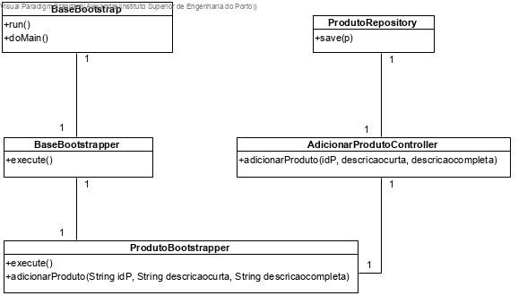
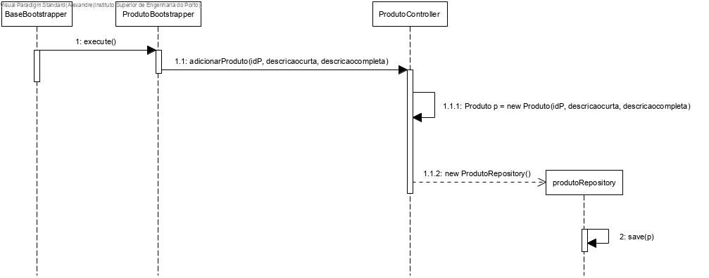

# US1006 (SPRINT B)
=======================================

# 1. Requisitos

Como Gestor de Projeto, eu pretendo que a equipa proceda à inicialização (bootstrap) de alguns produtos.

Para efetuar a realização deste US necessita-se que sejam implementadas as classes relativas a Produto e Catálogo, não esquecendo a base de dados.

# 2. Análise

O Gestor de Projeto, não tem uma autenticação necessária em sistema.

Após o arranque do bootstrap, toda a informação pré-escolhida acerca dos produtos terá de ser utilizável e de se encontrar na base de dados.

Um produto, de acordo com o MD, terá como atributo o seu ID. Um produto tem geralmente uma descrição curta e uma descrição completa. Relembrando que um produto pode ser uma matéria-prima também.

Todas os produtos encontram-se no catálogo do sistema, logo este tem de estar criado e apto para receber as mesmas.

É necessário testar a inserção de atributos nulos na BD e inserção de instâncias duplicadas.

"Achamos conveniente explicar que a nossa interpretação de catálogo é a seguinte: um catálogo é um conceito de negócio, no entanto não uma entidade visto que por definição uma matéria-prima se encontra num catálogo e não faria sentido não ser de esta forma. Desta maneira, o conjunto de todos os produtos é o catálogo."

# 3. Design

## 3.1. Realização da Funcionalidade

A equipa pré-definiu algumas informações para cada um dos produtos que vai adicionar ao sistema e o bootstrap irá adicionar os mesmos à base de dados (BD). Uma vez que os IDs são gerados automaticamente pela biblioteca JPA, estes não necessitam de ser pré-definidos.

## 3.2. Diagrama de Classes

## 3.3. Diagrama de Sequência

## 3.4. Padrões Aplicados

Estando-se a tratar de um projeto DDD, de todos os conceitos aplicados no MD, decidiu-se promover a classes de código *Produto* e *Descrição*.

Uma vez que estando-se a tratar de uma implementação com JPA, foram criadas as classes *JPARepositoryFactory* e *JPAProdutoRepository*, tam como as suas interfaces para que seja possível desenvolver métodos de edição da BD, tal como *deletes*, *finds* ou *saves*.

## 3.5. Testes

**Teste 1**: Verificar que entre runs deste bootstrap as informações presentes na base de dados são limpas e iniciadas de acordo com a informação que se pretende lá colocar.

**Teste 2**: Verificar que, apesar de não haver interação com um user via UI todas as verificações relativas aos produtos que se encontram em funcionamento.

# 4. Implementação

-

# 5. Integração/Demonstração

É uma instanciação inicial de produtos. Todas as funcionalidades que necessitem de produtos conseguem aceder a esta informação.

# 6. Observações

-
