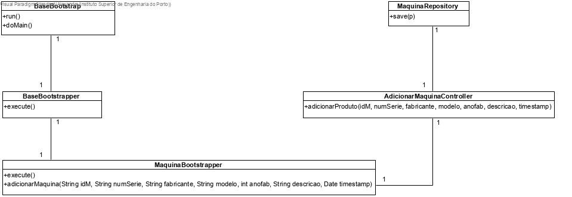

# US1007 (SPRINT B)
=======================================

# 1. Requisitos

Como Gestor de Projeto, eu pretendo que a equipa proceda à inicialização (bootstrap) de algumas de máquinas.

Para efetuar a realização deste US necessita-se que seja implementada a classe relativa a Máquina, não esquecendo a base de dados.

# 2. Análise

O Gestor de Projeto, não tem uma autenticação necessária em sistema.

Após o arranque do bootstrap, toda a informação pré-escolhida acerca das máquinas terá de ser utilizável e de se encontrar na base de dados.

Uma máquina, de acordo com o MD, terá como atributos o seu ID, número de série (numSerie), fabricante, o modelo, o ano de fabrico, uma descrição e o tempo de instalação (timestamp). É necessário validar se as datas e o timestamp introduzido são válidos (p.e ano de fabrico inferior ou igual ao ano atual).

É necessário testar a inserção de atributos nulos na BD e inserção de instâncias duplicadas.

# 3. Design

## 3.1. Realização da Funcionalidade

A equipa pré-definiu algumas informações para cada uma das máquinas que vai adicionar ao sistema e o bootstrap irá adicionar os mesmos à base de dados (BD). Uma vez que os IDs e os números de série são gerados automaticamente pela biblioteca JPA, estes não necessitam de ser pré-definidos. Seja pré-definido o seu fabricante, modelo, ano de fabrico e a sua descrição.

## 3.2. Diagrama de Classes

## 3.3. Diagrama de Sequência

## 3.4. Padrões Aplicados

Estando-se a tratar de um projeto DDD, de todos os conceitos aplicados no MD decidiu-se promover as classes de código *Máquina* e *Descrição*.

Uma vez que estando-se a tratar de uma implementação com JPA, foi criada a classe *JPAMachineRepository*, tal como a sua interface para que seja possível desenvolver métodos de edição da BD, tal como *deletes*, *finds* ou *saves*.

## 3.5. Testes

**Teste 1:** Verificar que entre runs deste bootstrap as informações presentes na base de dados são limpas e iniciadas de acordo com a informação que se pretende lá colocar.

**Teste 2:** Verificar que, apesar de não haver interação com um user via UI todas as verificações relativas às máquinas se encontram em funcionamento.

# 4. Implementação

-

# 5. Integração/Demonstração

É uma instanciação inicial das máquinas. Todas as funcionalidades que necessitem de máquinas conseguem aceder a esta informação.

# 6. Observações

-
