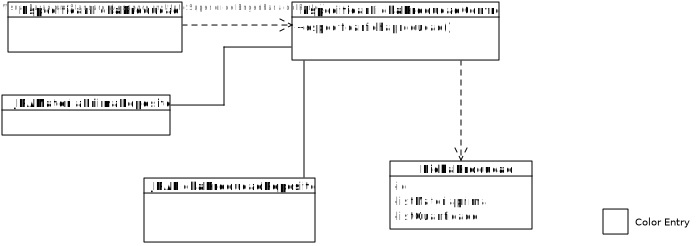
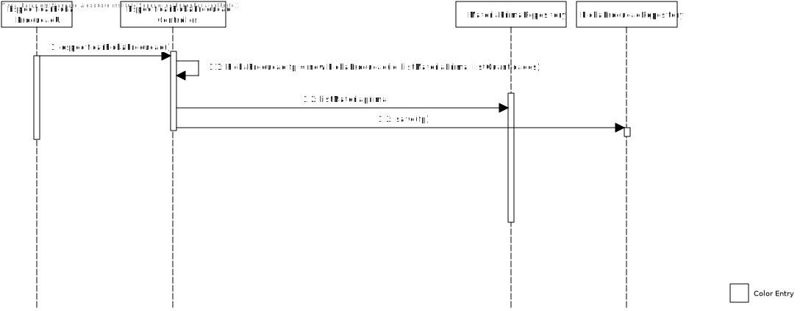

# US2004(SPRINT B)
=======================================

# 1. Requisitos

Como Gestor de Produção, eu pretendo especificar a Ficha de Produção de um dado produto.

Para efetuar a realização deste US necessita-se que seja implementada a classes relativa a MatériaPrima, não esquecendo a base de dados.

# 2. Análise

O Gestor de Produção vai ter uma autenticação necessária em sistema, para que possa editar, adicionar ou remover uma ficha de produção.

# 3. Design

## 3.1. Realização da Funcionalidade

1. O GP (autenticado no sistema) pretende definir a existência de uma ficha de produção.
2. O sistema pede as informações relativas à ficha de produção.
3. O GP introduz a informação.
4. O sistema regista a nova ficha de produção e informa do sucesso da operação.

## 3.2. Diagrama de Classes

## 3.3. Diagrama de Sequência

## 3.4. Testes

**Teste 1**: Verificar que não é possível definir uma ficha de produção que já exista.

**Teste 2**: Verificar que não é possível criar uma ficha de produção sem matéria-prima.

**Teste 3**: Verificar que não é possível definir uma ficha de produção com atributos nulos.

# 4. Implementação

-

# 5. Integração/Demonstração

-

# 6. Observações

Existindo uma ficha de produção para cada produto que seja fabricado, é importante que a lista de matéria-prima esteja sempre presente para a escolha na ficha de produção.
