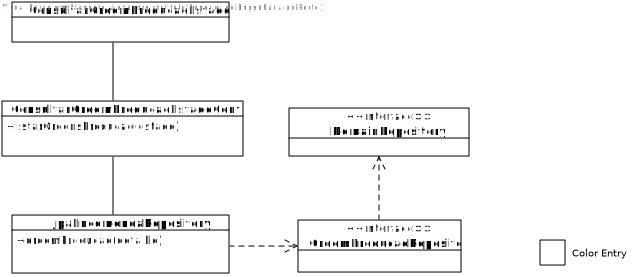
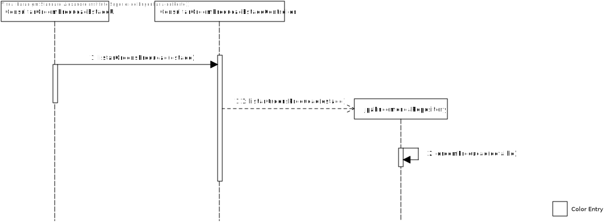

# US2011 - Consultar as Ordens de Produção num Determinado Estado (SPRINT C)
=======================================

# 1. Requisitos

Como Gestor de Produção, este pretende consultar as ordens de produção que estão num determinado estado. Deve permitir consultar o detalhe de cada ordem de produção.

# 2. Análise

O Gestor de Produção (GP) tem de se encontrar autenticado no sistema para poder consultar (listar) as ordens de produção que estejam num determinado estado.

Deve ser permitido consultar o detalhe de cada ordem de produção.

# 3. Design

## 3.1. Realização da Funcionalidade

1. O GP (autenticado no sistema) inicia um pedido para consultar as ordens de produção .
2. O sistema pede o estado da ordem de produção.
3. O GCF seleciona uma das opções.
4. O sistema apresenta as ordens de produção com o estado escolhido.

## 3.2. Diagrama de Classes

## 3.3. Diagrama de Sequência

## 3.4. Padrões Aplicados

Para esta funcionalidade utilizaram-se as classes OrdemProducao e JPAOrdemProducaoRepository, bem como uma interface para a implementação de métodos relacionados com a consulta e a modificação de dados em sistema relacionado com as ordens de produção.

## 3.5. Testes

-

# 4. Implementação

-

# 5. Integração/Demonstração

Para a demonstração desta User Story é fundamental que hajam ordens de produção previamente definidos no sistema, de modo a que seja possível demonstrar a funcionalidade na íntegra.

# 6. Observações

-
