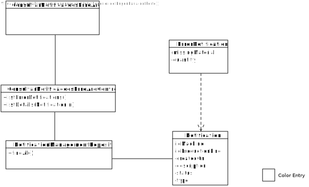

# US3007 - Consultar Notificações de Erros de Processamento Arquivadas (SPRINT C)
=======================================

# 1. Requisitos

Como Gestor de Chão de Fábrica, eu pretendo consultar as notificações de erros de processamento arquivadas.

# 2. Análise

O Gestor de Chão de Fábrica (GCF) tem de se encontrar autenticado no sistema para poder consultar (listar) todas as notificações de erros em sistema.

Os erros vão ser gerados pelas várias mensagens das máquinas, ou seja, as mensagens de falta de produto ou de matéria prima irão gerar estas notificações para que o Gestor de Chão de Fábrica as consiga consultar e resolver o problema em questão.

É importante que o id da máquina que gerou a notificação esteja presente assim como a sua descrição da mensagem, timestamp da criação e o tipo de erro para que aconteça a notificação.

O sistema irá permitir existir alguns filtros, tais como:

- ser capaz de apresentar todos os tipos de erro e através dele a lista das notificações existentes

- ser capaz de apresentar as linhas de produção e o utilizador seleciona uma para que sejam lidas as notificações geradas pela mesma

- ser capaz de apresentar as timestamps da criação da notificação;

- ser capaz de apresentar descrições da mensagem e o utilizador selecionar a que lhe interessa;

# 3. Design

## 3.1. Realização da Funcionalidade

1. O GCF (autenticado no sistema) inicia um pedido para ver as notificações de erro em sistema.
2. O sistema pede um critério para listar.
3. O GCF seleciona uma das opções.
4. O sistema apresenta a lista das notificações com base no critério de pesquisa selecionado.
5. O utilizador seleciona uma notificação.
6. O sistema apresenta informação detalhada sobre o mesmo.

## 3.2. Diagrama de Classes

## 3.3. Diagrama de Sequência

## 3.4. Padrões Aplicados

O padrão repository vai permitir que sejam listadas as linhas de produção e as notificações presentes na base de dados.

## 3.5. Testes

**Teste 1:** Verificar que as notificações são geradas a partir das mensagens.

**Teste 2:** Verificar que todos os parâmetros das notificações não podem ser nulos.

**Teste 3:** Verificar que as notificações apresentadas pertecem à linha de produção necessária.

**Teste 4:** Verificar que as notificações se encontram no intervalo de tempo necessário.

# 4. Implementação

-

# 5. Integração/Demonstração

A integração desta User-Story irá ser com a US5001, que trata o processamento das mensagens, ou seja quando uma mensagem é gerada e processada, poderá dar origem a uma notificação de erro para ser processada.

# 6. Observações

-
