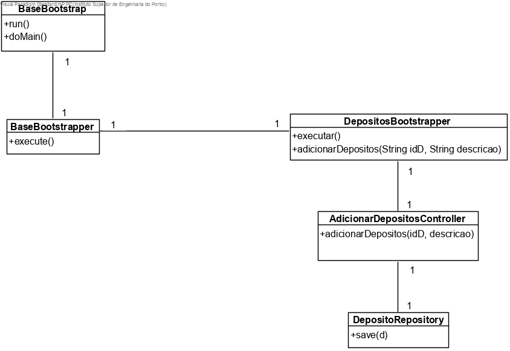
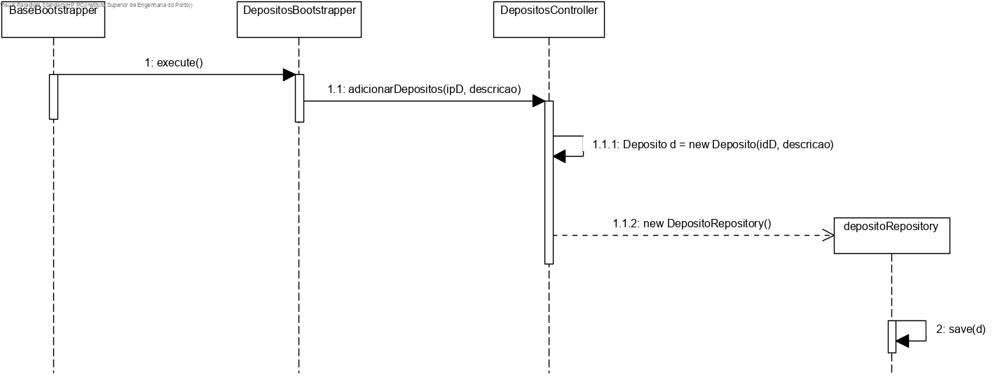

# US1009 (SPRINT B)
=======================================

# 1. Requisitos

Como Gestor de Projeto, eu pretendo que a equipa proceda à inicialização dos depósitos.

# 2. Análise

O user em questão: Gestor de Projeto, não tem uma autenticação necessária em sistema.

Após o arranque do bootstrap, toda a informação pré-escolhida acerca dos depósitos que terá de ser utilizável e de se encontrar na base de dados.

Um depósito terá como atributo o seu ID e a descrição (como podemos ver no MD).

É necessário testar a insersão de atributos nulos na BD e insersão de instâncias duplicadas.

# 3. Design

## 3.1. Realização da Funcionalidade

A equipa pré-define algumas informações, para cada um dos depósitos que vai adicionar ao sistema e o bootstrap irá adicionar as mesmas à base de dados.

## 3.2.1 Diagrama de Classes

## 3.2.2 Diagrama de Sequência

## 3.3. Padrões Aplicados

Aplicamos o padrão Factory para gerir a insersão de dados no sistema, através das classes JpaDepositoRepository e da classe RepositoryFactory.

O padrão controller permite que exista a classe AdicionarDepositoController que esteja responsável pela gestão de toda a US.

## 3.4. Testes

# 4. Implementação

# 5. Integração/Demonstração
