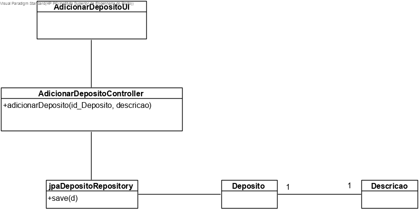
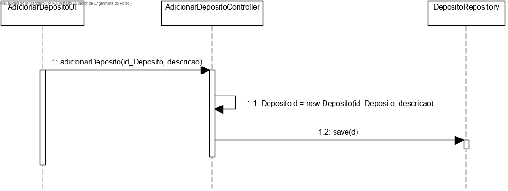

# US3003 (SPRINT B)
=======================================

# 1. Requisitos

Como Gestor de Chão de Fábrica, eu pretendo especificar a existência de um novo depósito.

# 2. Análise

O Gestor de Chão de Fábrica tem de se encontrar autenticado no sistema para que possa definir um novo depósito no mesmo.

Todos os depósitos existem no contexto de fábrica, logo os mesmos têm de ser associadas a uma fábrica, escolhida pelo Gestor de Chão de Fábrica.

As informações relativas aos depósitos são: id e descrição.

# 3. Design

## 3.1. Realização da Funcionalidade

A equipa pré-define algumas informações, para cada um dos depósitos que vai adicionar ao sistema e o bootstrap irá adicionar as mesmas à base de dados.

## 3.2.1 Diagrama de Classes

## 3.2.2 Diagrama de Sequência

## 3.3. Padrões Aplicados

Aplicamos o padrão Factory para gerir a insersão de dados no sistema, através das classes JpaMaquinaRepository e da classe RepositoryFactory.

O padrão controller permite que exista a classe AdicionarMaquinaController que, nesta situação, esteja responsável pela gestão de toda a US.

## 3.4. Testes

# 4. Implementação

O código-fonte existente respeita tanto o MD como o CD e SD

# 5. Integração/Demonstração
