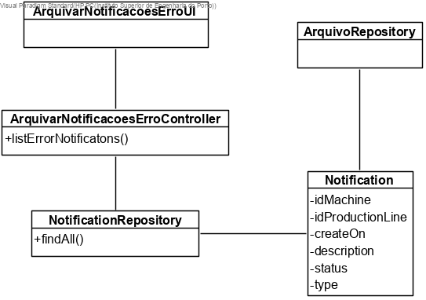
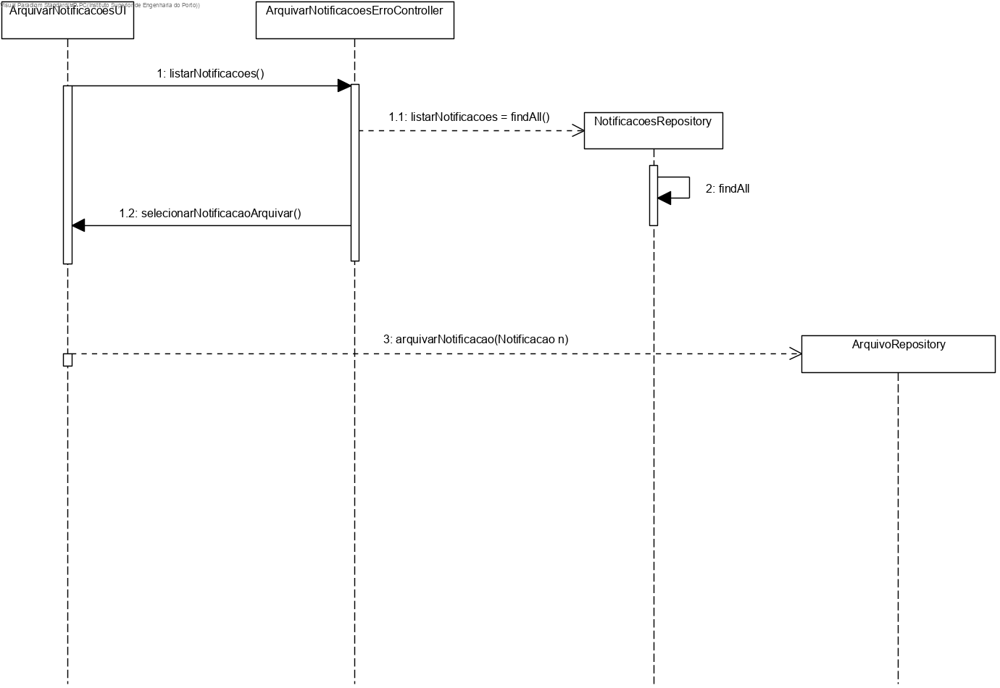

# US3006 - Arquivar notificações de erros de processamento. (SPRINT C)
=======================================

# 1. Requisitos

Como Gestor de Chão de Fábrica, eu pretendo arquivar uma ou mais notificações de erros de processamento.

# 2. Análise

O Gestor de Chão de Fábrica (GCF) tem de se autenticar devidamente para que possa iniciar um pedido para arquivar uma ou mais notificações de erros.
É apresentada uma lista de notificações de erros de processamento
O GCF seleciona a ou as notificações que quer arquivar
As notificações escolhidas são arquivadas e é apresentada uma mensagem de sucesso.

# 3. Design

## 3.1. Realização da Funcionalidade

1. O GCF (autenticado no sistema) inicia um pedido para arquivar uma ou mais notificações de erros.
2. É mostrada uma lista de notificações.
3. O GCF seleciona a pertendida.
4. As notificações são arquivadas.
5. É apresentada uma mensagem de sucesso.

## 3.2. Diagrama de Classes

## 3.3. Diagrama de Sequência

## 3.4. Padrões Aplicados

O padrão repository será utilizado para aceder à base de dados e obter a informação relativa a todas as máquinas nela existentes.

## 3.5. Testes

**Teste 1:** Verificar que a notificação existe.

# 4. Implementação

# 5. Integração/Demonstração

# 6. Observações
