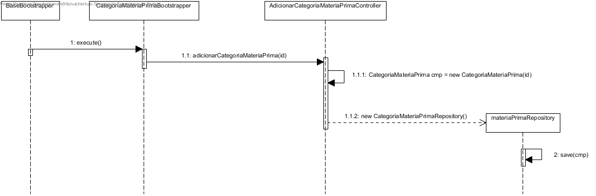

# US1005 (SPRINT B)
=======================================

# 1. Requisitos

Como Gestor de Projeto, eu pretendo que a equipa proceda à inicialização (bootstrap) de algumas categorias de matérias-primas.

# 2. Análise

O user em questão: Gestor de Projeto, não tem uma autenticação necessária em sistema.

Após o arranque do bootstrap, toda a informação pré-escolhida acerca das categorias de matérias-primas terá de ser utilizável e de se encontrar na base de dados.

Uma categoria de matérias-primas, de acordo com o MD, terá como atributo o seu id. Uma categoria de matérias-primas agrupa matérias-primas pertencentes a essa categoria.

É necessário testar a insersão de atributos nulos na BD e insersão de instâncias duplicadas.

# 3. Design

## 3.1. Realização da Funcionalidade

A equipa pré-define algumas informações, para cada uma das categorias de matérias-primas que vai adicionar ao sistema e o bootstrap irá adicionar as mesmas à base de dados.

## 3.2. Diagrama de Classes

## 3.3. Diagrama de Sequência

## 3.4. Padrões Aplicados

Foi utilizado o padrão controller que vai tratar de inserir a informação na BD.

Está também presente o padrão factory pois acedemos à classe JpaCategoriaMateriaPrimaRepository para dar save das instâncias iniciais de categorias de matérias-primas.

## 3.5. Testes

**Teste 1:** Verificar que entre runs deste bootstrap as informações presentes na base de dados são limpas e iniciadas de acordo com a informação que se pretende lá colocar.

**Teste 2:** Verificar que, apesar de não haver interação com um user via UI todas as verificações relativas às categorias de matérias-primas se encontram em funcionamento.

# 4. Implementação

Podemos verificar que, de acordo com o SD desta US, todas as classes presentes e as transações efetuadas se encontram no código-fonte do projeto.

# 5. Integração/Demonstração

Uma vez que se trata da instanciação inicial de Categoria de matérias-primas, todas as outras funcionalidades e àreas de negócio que tratem de categorias conseguem aceder a esta informação.

# 6. Observações

-
