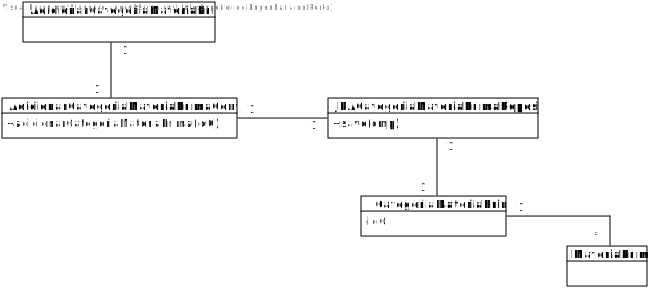
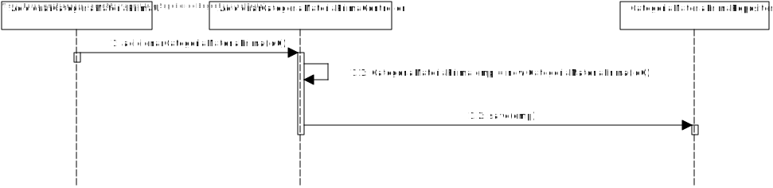

# US2002 (SPRINT B)
=======================================

# 1. Requisitos

Como Gestor de Produção (GP), eu pretendo definir uma nova categoria de matérias-primas.

# 2. Análise

O Gestor de Produção tem de se encontrar autenticado para poder efetuar a adição de uma categoria de matérias-primas.

A informação necessária sobre a categoria deve ser pedida ao GP e posteriormente validada para que esta possa ser adicionada em sistema. A informação consiste no id da categoria.

É necessário validar o id, tendo em conta que ele não pode ser nulo ou repetido. Uma categoria vai englobar as matérias-primas que lhe pertencem.

# 3. Design

## 3.1. Realização da Funcionalidade

1. O GP (autenticado em sistema) pretende adicionar uma nova categoria de matérias-primas
2. O sistema pede o id da categoria que se vai adicionar.
3. O GP introduz a informação necessária.
4. O sistema valida a mesma, efetua a criação da categoria e informa do sucesso da operação.

## 3.2. Diagrama de Classes

## 3.3. Diagrama de Sequência

## 3.4. Padrões Aplicados

Tendo em conta o padrão DDD, elaboramos as classes CategoriaMateriaPrima e Matéria-Prima, sendo que foram promovidas a classes a partir dos conceitos identificados no MD.

Aplicamos o padrão Factory para gerir a insersão de dados no sistema, através das classes JpaCategoriaMateriaPrimaRepository e da classe RepositoryFactory.

O padrão controller permite que exista a classe AdicionarCategoriaMateriaPrimaController que, nesta situação, esteja responsável pela gestão de toda a US.

## 3.5. Testes

**Teste 1:** Verificar que não é possível criar uma instância da classe CategoriaMateriaPrima com valores nulos.

**Teste 2:** Verificar que não é possível definir uma CategoriaMateriaPrima que já exista.

# 4. Implementação

Podemos verificar que, de acordo com o SD desta US, todas as classes presentes e as transações efetuadas se encontram no código-fonte do projeto.

# 5. Integração/Demonstração

-

# 6. Observações

-
