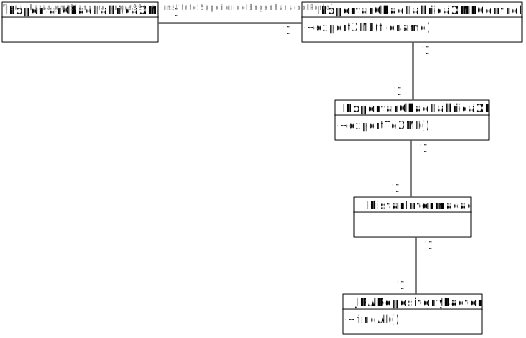
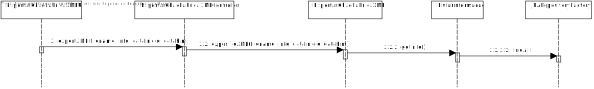

# US2007 (SPRINT B)
=======================================

# 1. Requisitos

Como Gestor de Produção, eu pretendo exportar, para um ficheiro XML, toda a
infomação subjacente ao chão de fábrica (e.g. produtos, matérias-primas, máquinas,
linhas de produção, categorias, ordens de produção, fichas de produção, lotes,
consumos reais e efetivos, estornos, desvios, tempos de produção, entre outros).

# 2. Análise

O Gestor de Produção tem de se encontrar autenticado para poder efetuar a exportação
da informação para um ficheiro XML.

Deve ser pedido qual/quais os tipos de dados a exportar.

No caso de serem aplicados filtros temporais, as datas tem que ser validadas.

# 3. Design

## 3.1. Realização da Funcionalidade

1. O Gestor de Produção inicia a exportação da informação subjacente ao chão de fábrica.
2. O sistema solicita o nome do ficheiro.
3. O Gestor de Produção introduz o nome do ficheiro solicitado.
4. O sistema pede quais os dados a exportar.
5. O Gestor de Produção introduz os tipos de dados a exportar.
6. O sistema solicita filtros temporais.
7. O Gestor de Produção introduz os filtros temporais.
8. O sistema exporta os dados e informa do sucesso da operação.

## 3.2. Diagrama de Classes

## 3.3. Diagrama de Sequência

## 3.4. Padrões Aplicados

O padrão controller permite que exista a classe ExportarChaoFabricaXMLController que,
nesta situação, esteja responsável pela gestão de toda a US.

## 3.5. Testes

-

# 4. Implementação

-

# 5. Integração/Demonstração

-

# 6. Observações

-
