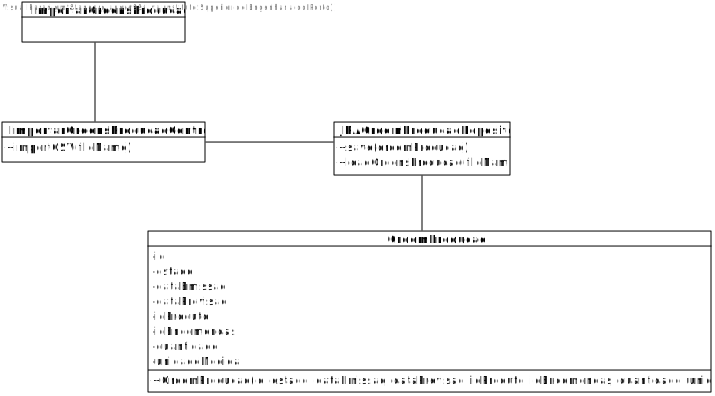
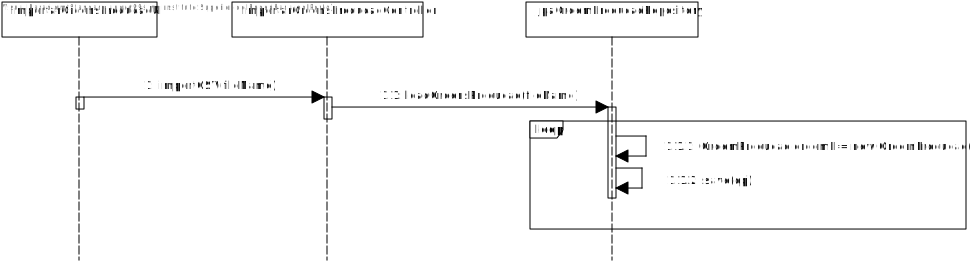

# US2009 (SPRINT B)
=======================================

# 1. Requisitos

Como Gestor de Produção, eu pretendo importar ordens de produção através de um ficheiro CSV.

# 2. Análise

O Gestor de Produção (GP) tem de se encontrar autenticado no sistema para que
possa importar uma nova ordem de produção.

A informação relativa ao nome do ficheiro deve ser pedida ao GP.

Uma ordem de produção terá como atributos o seu ID, o estado da ordem, a data de emissão,
a previsão de execução, o id do produto a produzir, id das encomendas, a quantidade e a unidade de
medida.

# 3. Design

## 3.1. Realização da Funcionalidade

1. O Gestor de Produção inicia a importação das ordens de produção.
2. O sistema solicita o nome do ficheiro com o catálogo.
3. O Gestor de Produção introduz o nome do ficheiro solicitado.
4. O sistema importa as ordens de produção e comunica o sucesso da operação.

## 3.2. Diagrama de Classes

## 3.3. Diagrama de Sequência

## 3.4. Padrões Aplicados

Aplicamos o padrão Factory para gerir a insersão de dados no sistema, através das classes JpaOrdemProducaoRepository e da classe RepositoryFactory.

## 3.5. Testes

- **Teste 1:** Verificar que não é possível criar uma instância da classe Ordem de Produção com valores nulos.

- **Teste 2:** Verificar que não é possível adicionar ao catálogo de ordens de produção uma instância que já exista no mesmo.

# 4. Implementação

-

# 5. Integração/Demonstração

-

# 6. Observações

-
