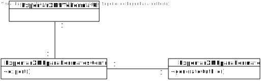
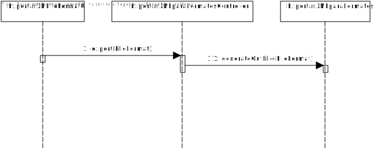

# US2013 (SPRINT D)
=======================================

# 1. Requisitos

Como Gestor de Produção, eu pretendo aplicar uma visualização/transformação
(das várias disponiveis) a um ficheiro XML anteriormente gerado/exportado por
mim (através do sistema).

Pelos menos 3  visualizações/transformações são requeridas: (i) para HTML,
(ii) para JSON e (iii) texto (para leitura por humanos); sempre através de XSLT.
O resultado/output deve ser outro ficheiro, mantendo o ficheiro original inalterado.

# 2. Análise

O Gestor de Produção (GP) tem de se encontrar autenticado no sistema para que
possa proceder à transformação do XML.

A informação relativa ao tipo de transformação deve ser pedida ao GP.

É necessário que o ficheiro XML exista no projeto.

# 3. Design

## 3.1. Realização da Funcionalidade

1. O Gestor de Produção inicia a transformação do XML
2. O sistema solicita qual dos tipos para transformar (HTML, JSON ou TXT).
3. O Gestor de Produção o tipo do ficheiro.
4. O sistema transforma o XML e informa do sucesso da operação.

## 3.2. Diagrama de Classes

## 3.3. Diagrama de Sequência

## 3.4. Padrões Aplicados

Aplicamos o padrão Controller para gerir a US.

# 4. Implementação

-

# 5. Integração/Demonstração

-

# 6. Observações

-
