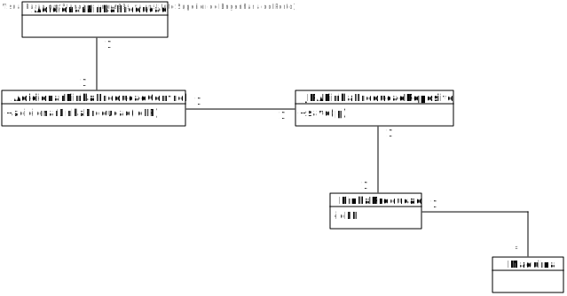
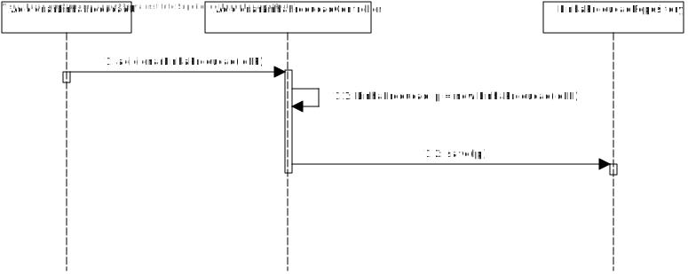

# US3002 (SPRINT B)
=======================================

# 1. Requisitos

Como Gestor de Chão de Fábrica, eu pretendo especificar uma nova linha de produção.

# 2. Análise

O Gestor de Chão de Fábrica (GCF) tem de se encontrar autenticado no sistema para que possa especificar uma nova linha de produção.

A informação relativa à linha de produção deve ser pedida ao GCF e consiste no id. Uma linha de produção vai agrupar a lista de máquinas pertencentes a essa linha. Note-se que no MD a linha de produção apresenta mais ligações, no entanto, nesta fase do projeto, ainda não faz sentido representa-las.

É necessário validar o id, tendo em conta que ele não pode ser nulo ou repetido.

# 3. Design

## 3.1. Realização da Funcionalidade

1. O GCF (autenticado no sistema) pretende especificar uma nova linha de produção.
2. O sistema pede o id da nova linha de produção.
3. O CGF introduz a informação.
4. O sistema valida a mesma efetua a criação da linha de produção e informa do sucesso da operação.

## 3.2. Diagrama de Classes

## 3.3. Diagrama de Sequência

## 3.4. Padrões Aplicados

Tendo em conta o padrão DDD, elaboramos as classes LinhaProducao e Maquina, sendo que foram promovidas a classes a partir dos conceitos identificados no MD.

Aplicamos o padrão Factory para gerir a insersão de dados no sistema, através das classes JpaLinhaProducaoRepository e da classe RepositoryFactory.

O padrão controller permite que exista a classe AdicionarLinhaProducaoController que, nesta situação, esteja responsável pela gestão de toda a US.

# 4. Implementação

Podemos verificar que, de acordo com o SD desta US, todas as classes presentes e as transações efetuadas se encontram no código-fonte do projeto.

# 5. Integração/Demonstração

-

# 6. Observações

-
