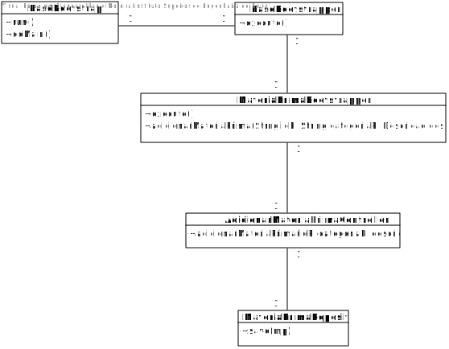
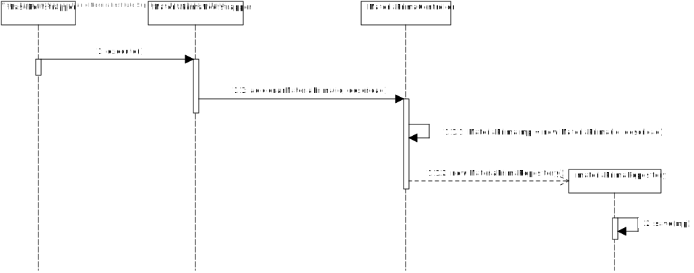

# US1004 - Bootstrap Matérias-Primas (SPRINT B)
================================================

# 1. Requisitos

Como Gestor de Projeto, eu pretendo que a equipa proceda à inicialização (bootstrap) de algumas matérias-primas.

# 2. Análise

O user em questão: Gestor de Projeto, não tem uma autenticação necessária em sistema.

Após o arranque do bootstrap, toda a informação pré-escolhida acerca das matérias-primas terá de ser utilizável e de se encontrar na base de dados.

Uma matéria-prima (MP), de acordo com o MD, terá como atributo o seu ID. Uma matéria-prima pertence a uma categoria e tem associada uma ficha técnica.

O conjunto de todas as MP's é o catálogo de matérias primas do sistema.

É necessário testar a insersão de atributos nulos na BD e insersão de instâncias duplicadas.

Achamos conveniente explicar que a nossa interpretação de catálogo é a seguinte: um catálogo é um conceito de negócio, no entanto não uma entidade visto que por definição uma matéria-prima se encontra num catálogo e não faria sentido não ser de esta forma. Desta maneira, o conjunto de todas as MP's é o catálogo.

# 3. Design

## 3.1. Realização da Funcionalidade

A equipa pré-define algumas informações, para cada uma das matérias-primas que vai adicionar ao sistema e o bootstrap irá adicionar as memas à base de dados (BD).

Os ID's inseridos não têm um padrão de geração específico, no entanto consideramos que devem seguir um uma vez que são um dado importante e com relevância para o negócio, descartando a geração automática de ID's.

## 3.2. Diagrama de Classes

## 3.3. Diagrama de Sequência

## 3.3. Padrões Aplicados

O padrão controller foi utilizado aqui para que seja respeitado como no restante projeto, ou seja continua a ser o controller que trata da insersão da informação no entanto não existe uma interação com o user porque se trata de *hard-codded information*.

O padrão factory continua presente visto que acedemos à classe JpaMateriaPrimaRepository para dar save das instâncias iniciais de matérias primas.

## 3.4. Testes

**Teste 1:** Verificar que entre runs deste bootstrap as informações presentes na base de dados são limpas e iniciadas de acordo com a informação que se pretende lá colocar.

**Teste 2:** Verificar que, apesar de não haver interação com um user via UI todas as verificações relativas às matérias-primas se encontram em funcionamento.

# 4. Implementação

A implementação está básica, ou seja dois aspetos importantes faltam: atribuiçao a uma ficha técnica de uma matéria prima e seleção de categorias de matérias primas que englobem as MP's inseridas.

# 5. Integração/Demonstração

Uma vez que se trata da instanciação inicial de matérias-primas, todas as outras funcionalidades e àreas de negócio que tratem de MP's conseguem aceder a esta informação.

Apenas é ativada quando é necessário, ou seja, não existe criação informação desnecessária sem que assim o seja pretendido.

# 6. Observações

Depois da inicialização desta informação, não conseguimos limpar a base de dados automaticamente, sendo que entre runs do bootstrap teremos de dar drop manualmente da informação lá presente para evitar conflitos de SQL.