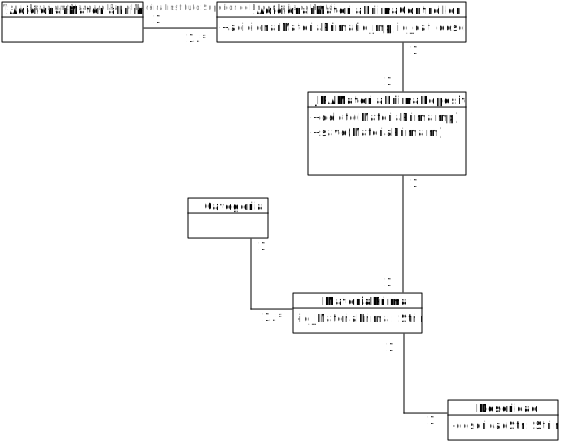
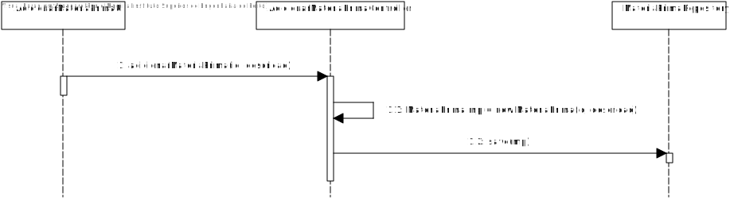

# US2001 - Adicionar Matéria-Prima (SPRINT B)
==============================================

# 1. Requisitos

Como Gestor de Produção, eu pretendo adicionar uma matéria-prima ao catálogo.

# 2. Análise

O Gestor de Produção (GP) tem de se encontrar autenticado para poder efetuar uma adição de uma matéria-prima (MP) ao catálogo.

A informação necessária sobre a MP deve ser pedida ao GP e posteriormente validada para que esta possa ser adicionada em sistema. A informação é a seguinte: uma categoria para enquadrar esta MP, um ID de MP, que acreditamos ter valor para o negócio logo segue algum padrão e uma descrição sobre essa mesma MP.

É necessário validar todos estes dados, tendo em conta que nenhum deles pode ser nulo. A categoria deve ser escolhida de entre as que já exister ou a possibilidade de uma nova ser criada deve existir.

# 3. Design

## 3.1. Realização da Funcionalidade

1. O GP (autenticado em sistema) pretende adicionar uma nova MP ao catálogo.
2. O sistema pede toda a informação necessária para adicionar uma nova MP.
3. O GP introduz a informação necessária.
4. O sistema valida a mesma, efetua a adição da MP ao catálogo e informa do sucesso da operação.

## 3.2. Diagrama de Classes

## 3.3. Diagrama de Sequência

## 3.4. Padrões Aplicados

Tendo em conta o padrão DDD, elaboramos as classes *Descrição*, *Matéria-Prima* e *Categoria*, sendo que foram promovidas a classes a partir dos conceitos identificados no MD.

Para que sejamos eficientes e corretos, temos duas classes *Repository*, sendo que acedemos à *MateriaPrimaRepository* a partir da *RepositoryFactory*, de acordo com a implementação de JPA. Existem duas interfaces associadas a estas duas classes também para implementação de métodos relacionados com a modificação de dados em sistema.

Assim, verificamos a existência dos padrões Factory e Controller, uma vez que as classe Repository ficam encarregues pela gestão dos dados e o controller da User Story coordena todos os passos da US.

## 3.5. Testes

**Teste 1:** Verificar que não é possível criar uma instância da classe matéria-prima com valores nulos.

**Teste 2:** Verificar que não é possível adicionar ao catálogo uma instância da classe matéria-prima que já exista no mesmo.

# 4. Implementação

Podemos verificar que, de acordo com o SD desta US, todas as classes presentes e as transações efetuadas se encontram no código-fonte do projeto.

# 5. Integração/Demonstração

Um dos pontos referidos na análise é de que deve existir a possibilidade de ser criada uma categoria caso o GP tenha a necessidade de tal, logo esta US está em relação direta com a US2002.

# 6. Observações

As matérias-primas adicionadas não se encontram num catálogo *físico* uma vez que não identificamos como necessidade que uma MP exista solta no nosso sistema, porque se tal acontecer não se trata de uma MP usável.