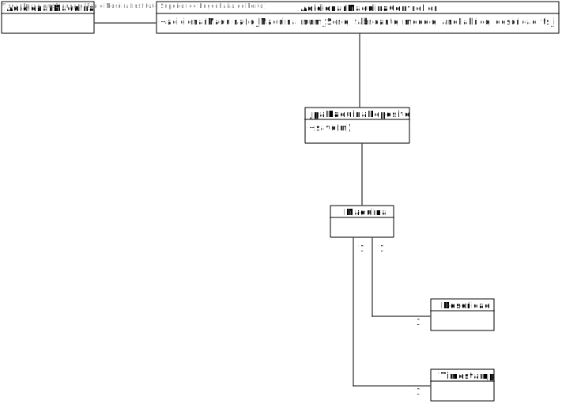

# US3001 - Adicionar Máquina (SPRINT B)
========================================

# 1. Requisitos

  Como Gestor de Chão de Fábrica, eu pretendo definir a existência de uma nova máquina.

# 2. Análise

O Gestor de Chão de Fábrica (GCF) tem de se encontrar autenticado no sistema para que possa definir uma nova máquina no mesmo.

Todas as máquinas existem no contexto de uma linha de produção, logo as mesmas têm de ser associadas a uma linha de produção, escolhida pelo GCF.

As informações relativas às máquinas são: id, número de série, fabricante, modelo, ano de fabrico, descrição e um timestamp de instalação da mesma. Note-se que nenhum destes parâmetros podem ser nulos.

É necessário validar se as datas e o timestamp introduzido são válidos (p.e ano de fabrico inferior ou igual ao ano atual).

# 3. Design

## 3.1. Realização da Funcionalidade

1. O GCF (autenticado no sistema) pretende definir a existência de uma nova máquina.
2. O sistema pede as informações relativas à nova máquina.
3. O CGF introduz a informação.
4. O sistema regista a nova máquina e informa do sucesso da operação.

## 3.2. Diagrama de Classes

## 3.3. Diagrama de Sequência

## 3.4. Padrões Aplicados

Aplicamos o padrão Factory para gerir a insersão de dados no sistema, através das classes JpaMaquinaRepository e da classe RepositoryFactory.

O padrão controller permite que exista a classe AdicionarMaquinaController que, nesta situação, esteja responsável pela gestão de toda a US.

## 3.5. Testes

**Teste 1:** Verificar que não é possível criar uma instância da classe máquina com valores nulos.

**Teste 2:** Verificar que não é possível definir máquinas que já existam.

**Teste 3:** Verificar que não é possível definir máquinas cujo timestamp de instalação não seja válido (e.g o timestamp ser de uma data posterior à de definição da máquina em sistema).

# 4. Implementação

De acordo com o CD e o SD, o código-fonte existente respeita o que foi acima indicado, no entanto ainda faltam várias verificações de dados, tanto das máquinas como dentro dos seus parâmetros (p.e descrição).

# 5. Integração/Demonstração

Idealizamos que uma máquina só pode existir no contexto de uma linha de produção, no entanto essa integração ainda não se encontra presente em sistema, sendo que contrariamente ao que é suposto acontecer, existem máquinas soltas em sistema.

# 6. Observações
