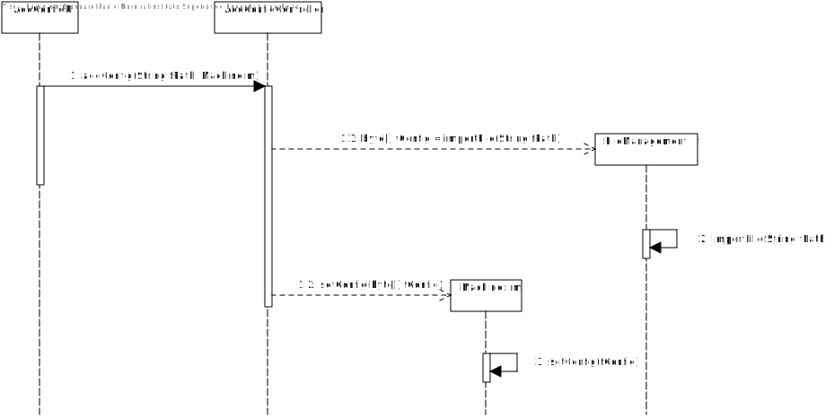

# US3004 - Associar um ficheiro de configuração a uma máquina (SPRINT C)
=========================================================================

# 1. Requisitos

Como Gestor de Chão de Fábrica, eu pretendo associar um ficheiro de configuração a uma máquina.

# 2. Análise

O Gestor de Chão de Fábrica (GCF) tem de se encontrar devidamente autenticado no sistema para que consiga associar um ficheiro de configuração a uma máquina.

O ficheiro de configuração neste momento não tem relevância para o sistema em si, apenas para a máquina e o seu conteúdo varia de acordo com as várias máquinas existentes em sistema. Assim, o seu conteúdo e formato pode variar e, desta forma, o sistema deve compensar e ser capaz de associar qualquer tipo de ficheiro a uma máquina.

Apenas se pode adicionar ficheiros de configuração a máquinas já existentes em sistema.

Os ficheiros têm de existir e o seu conteúdo terá de ser não-nulo.

# 3. Design

## 3.1. Realização da Funcionalidade

1. O GCF (autenticado no sistema) inicia um pedido para associar um ficheiro de configuração a uma máquina.
2. O sistema apresenta a lista de todas as máquinas existentes em sistema e pede para ser uma selecionada.
3. O GCF seleciona uma máquina.
4. O sistema pede o caminho do ficheiro presente na máquina do CGF.
5. O GCF introduz o caminho pedido.
6. O sistema importa o conteúdo do ficheiro, associa o mesmo à máquina e informa do sucesso da operação.

## 3.2. Diagrama de Classes

## 3.3. Diagrama de Sequência

## 3.4. Padrões Aplicados

O padrão repository será utilizado para aceder à base de dados e obter a informação relativa a todas as máquinas nela existentes.

## 3.5. Testes

**Teste 1:** Verificar que o ficheiro existe.

**Teste 2:** Verificar que o conteúdo do ficheiro é não nulo.

# 4. Implementação

# 5. Integração/Demonstração

Esta user-storie não tem nenhuma dependência direta com as restantes, uma vez que atualmente não existe necessidade em sistema de ser exportada ou utilizada esta configuração introduzida para as máquinas.

# 6. Observações

O ficheiro é importado em sistema sob a forma de 'bytes', o que significa que toda a informação será associada à máquina e poderá ser exportada para qualquer formato de ficheiro. Esta forma de importação permite que qualquer formato seja lido.