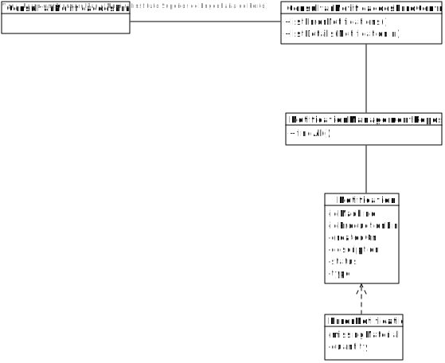

# US3005 - Consultar Notificações de Erros (SPRINT C)
======================================================

# 1. Requisitos

Como Gestor de Chão de Fábrica, eu pretendo consultar as notificações de erros de processamento por tratar.

# 2. Análise

O Gestor de Chão de Fábrica (GCF) tem de se encontrar devidamente autenticado no sistema para poder consultar (listar) todas as notificações de erros em sistema.

Os erros vão ser gerados pelas várias mensagens das máquinas, entre os quais e, com base no que está presente no [fórum de LAPR4](https://moodle.isep.ipp.pt/mod/forum/discuss.php?d=30509#p40719), *o sistema a desenvolver deve focar-se nas falhas relacionadas com menção a informação em falta no sistema*, ou seja, as mensagens de falta de produto ou de matéria prima irão gerar estas notificações para que o GCF as consiga consultar e resolver o problema em questão.

Será pertinente ter em consideração alguns aspetos sobre estas notificações: 
- o id da máquina que a gerou e consequentemente a que linha de produção pertence
- a descrição gerada pela mensagem que originou a notificação
- o timestamp de quando a notificação foi criada em sistema
- o tipo de erro em questão

Existem duas vertentes para esta User Storie:
- o sistema deve ser capaz de apresentas todos os tipos de erro e, mediante o selecionado, o mesmo lista as notificações existentes
- o sistema apresenta as linhas de produção e o utilizador seleciona uma para que sejam lidas as notificações geradas pela mesma

# 3. Design

## 3.1. Realização da Funcionalidade

1. O GCF (autenticado no sistema) inicia um pedido para ver as notificações de erro em sistema.
2. O sistema pede um critério para listar: uma linha de produção ou um intervalo de tempo.
3. O GCF seleciona uma das opções.
4. O sistema apresenta a lista das notificações com base no critério de pesquisa selecionado.
5. O utilizador seleciona uma notificação.
6. O sistema apresenta informação detalhada sobre o mesmo.

## 3.2. Diagrama de Classes

## 3.3. Diagrama de Sequência

## 3.4. Padrões Aplicados

O padrão repository vai permitir que sejam listadas as linhas de produção e as notificações presentes na base de dados. Iremos utilizar um controller para este use-case, logo temos presente também o padrão controller.  
Por fim, iremos utilizar o padrão Builder para construir as notificações geradas a partir das mensagens.

## 3.5. Testes

**Teste 1:** Verificar que as notificações são geradas a partir das mensagens.

**Teste 2:** Verificar que todos os parâmetros das notificações não podem ser nulos.

**Teste 3:** Verificar que as notificações apresentadas pertecem à linha de produção necessária.

**Teste 4:** Verificar que as notificações se encontram no intervalo de tempo necessário.

# 4. Implementação

# 5. Integração/Demonstração

A integração desta User-Story irá ser com a US5001, que trata o processamento das mensagens, ou seja quando uma mensagem é gerada e processada, poderá dar origem a uma notificação de erro para ser processada.

Também se encontra integrada com a US3006 uma vez que se refere ao arquivo de notificações existentes em sistema.

# 6. Observações

Esta US pode ser testada independente das restantes na eventualidade de alguma não ser finalizada, uma vez que podemos instanciar alguns erros apenas para verificar se tanto a filtragem destes por linha de produção como por intervalo de tempo está correta.