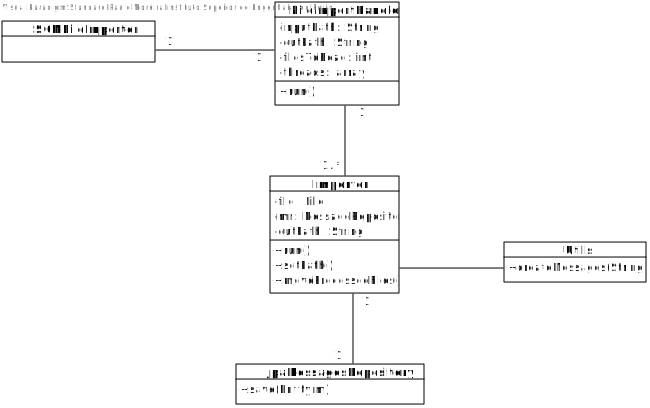
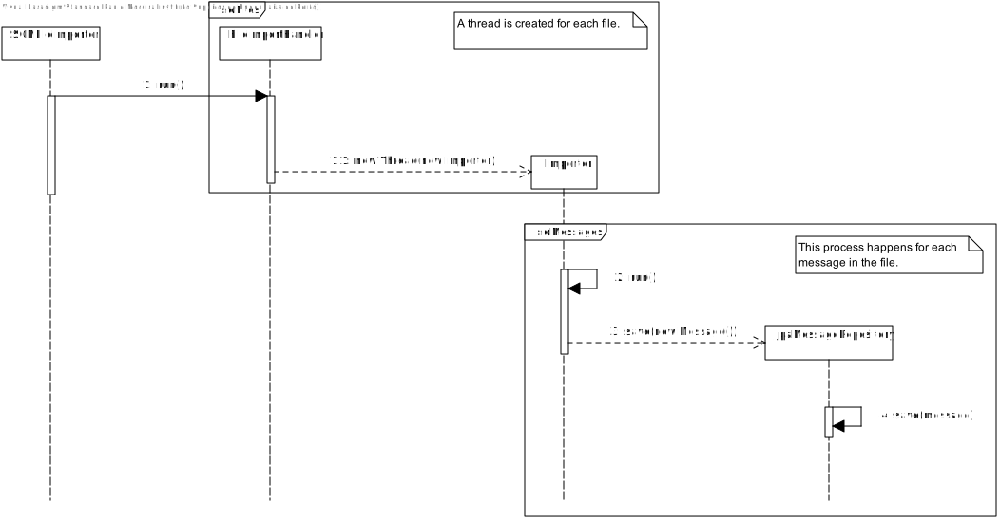

# US4001 - Importar Ficheiros de Mensagens (SPRINT C)
======================================================

# 1. Requisitos

Como Serviço de Comunicação com as Máquinas (SCM), pretendo importar, de forma concorrente/paralela, as mensagens existentes nos ficheiros de texto presentes no diretório de entrada de forma a disponibilizar as mesmas para processamento.

# 2. Análise

O SCM vai processar todas as mensagens existentes nos vários ficheiros associados a cada máquina através da extensão do ficheiro:
- Mensagens.T3 -> Máquina T3
- Mensagens.DD4 -> Máquina DD4

Todas as mensagens irão ser guardadas numa tabela "Mensagens" e ficam assim disponíveis em todo o sistema para que sejam processadas pelas máquinas.

Uma thread será criada para cada um dos ficheiros, para agilizar o processo de leitura. Esta decisão também se deve ao facto de que assim caso queiramos conectar este UC a um servidor podemos ter uma conexão por máquina/por ficheiro e permitir multi-threads/processos concorrentes.

As duplicações de mensagens serão verificadas através da data e momento de criação.

# 3. Design

## 3.1. Realização da Funcionalidade

Sendo que esta é uma funcionalidade independente do sistema, não existe interação com o utilizador.
Existe um executável que permite correr o método de importação para que possam ser importados quantos ficheiros forem necessários.

## 3.2. Diagrama de Classes

## 3.3. Diagrama de Sequência

## 3.4. Padrões Aplicados

Aplicamos o padrão repository para persistir as mensagens na base de dados para serem processadas posteriormente. O padrão strategy também foi utilizado uma bez que temos uma superclasse "Mensagem" que se subdivide em vários tipos de mensagem, para que no futuro possam ser removidos ou adicionados novos tipos de mensagens.

## 3.5. Testes

**Teste 1:** Verificar que ficheiros vazios são descartados.

**Teste 2:** Verificar que mensagens duplicadas são ignoradas.

# 4. Implementação

# 5. Integração/Demonstração

Esta US está integrada com a US1011 uma vez que representa uma forma alternativa de importar mensagens para sistema.

# 6. Observações