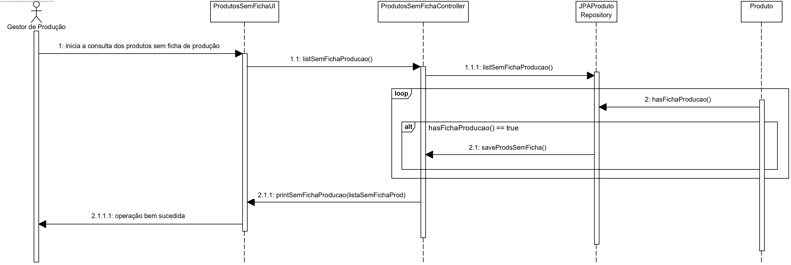
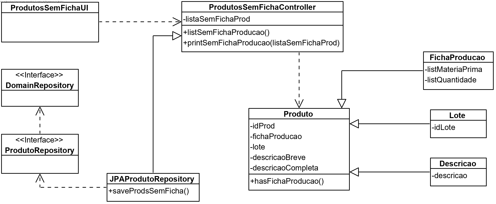

# User Story #2003
=======================================

# 1. Requisitos

**US2003**

Esta User Story consiste em consultar os produtos que não têm um Ficha de Produção definida, enquanto Gestor de Produção.

# 2. Análise

Para esta funcionalidade será necessária uma autenticação prévia como Gestor de Produção (GP), já que este utilizador deve ter acesso ao catálogo de produtos, para, neste caso, o consultar.

# 3. Design

## 3.1. Realização da Funcionalidade

1. O Gestor de Produção (autenticado em sistema) pretende consultar os produtos que não têm uma ficha de produção definida.
2. O sistema consulta a base de dados, apresenta ao utilizador os produtos cuja ficha de produção não está definida e comunica o sucesso da operação.



## 3.2. Diagrama de Classes



## 3.3. Padrões Aplicados

Dado o padrão DDD, implementamos as classes _Descricao_ e _Produto_, previamente conceitos identificados no Modelo de Domínio e posteriormente promovidos a classes.
Para aumentar a eficiência, e seguindo a implementação do JPA, elaboramos ainda a classe _JPAProdutoRepository_, bem como duas _interfaces_ para a implementação de métodos relacionados com a modificação de dados em sistema.

## 3.4. Testes

- **Teste 1:** Verificar o reconhecimento por parte da funcionalidade de um produto cuja ficha de produção não tenha sido propositadamente definida.

- **Teste 2:** Verificar que não são apresentados resultados quando todos os produtos têm uma ficha de produção definida.

# 4. Implementação

-

# 5. Integração/Demonstração

Para a demonstração desta User Story é fundamental que hajam produtos previamente definidos no sistema, de modo a que seja possível demonstrar a funcionalidade na integra.

# 6. Observações

-
















