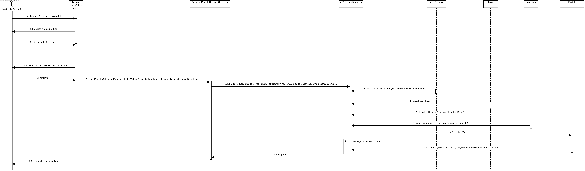

# User Story #2006
=======================================

# 1. Requisitos

**US2006**

Esta User Story consiste em adicionar um novo produto ao catálogo de produtos, enquanto Gestor de Produção.

# 2. Análise

Para esta funcionalidade será necessária uma autenticação prévia como Gestor de Produção (GP), já que este utilizador deve ter acesso ao catálogo de produtos, para, neste caso, o alterar.

# 3. Design

## 3.1. Realização da Funcionalidade

1. O Gestor de Produção inicia a adição de um produto ao catálogo.
2. O sistema solicita os dados necessários para adicionar um novo produto.
3. O Gestor de Produção introduz os dados necessários.
4. O sistema mostra o os dados introduzidos e solicita confirmação.
5. O Gestor de Produção confirma os dados introduzidos.
6. O sistema adiciona o novo produto ao catálogo e comunica o sucesso da operação.



## 3.2. Diagrama de Classes



## 3.3. Padrões Aplicados

Para esta funcionalidade utilizou-se as mesmas classes _Descricao_, _Produto_ e _JPAProdutoRepository_, bem como as duas _interfaces_ para a implementação de métodos relacionados com a modificação de dados em sistema, elaboradas no desenvolvimento da User Story 2003. Isto acontece uma vez que vamos utilizar o mesmo tipo de objetos utilizados nessa User Story.

## 3.4. Testes

- **Teste 1:** Verificar que não é possível criar uma instância da classe Produto com valores nulos.

- **Teste 2:** Verificar que não é possível adicionar ao catálogo de produtos uma instância que já exista no mesmo.

# 4. Implementação

-

# 5. Integração/Demonstração

-

# 6. Observações

Os produtos adicionados não se encontram num catálogo "físico" uma vez que não identificamos como necessidade que um Produto exista "solto" no sistema, porque se tal acontecer não se trata de um Produto utilizável.






















