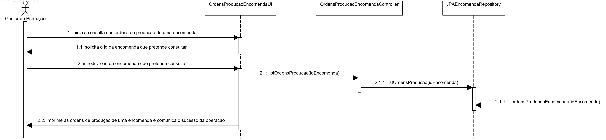

# User Story #2012
=======================================

# 1. Requisitos

**US2012**

Esta User Story consiste em consultar as ordens de produção de uma encomenda, enquanto Gestor de Produção.

# 2. Análise

Para esta funcionalidade será necessária uma autenticação prévia como Gestor de Produção (GP), já que este utilizador deve ter acesso à introdução e recolha de informação de uma encomenda.

# 3. Design

## 3.1. Realização da Funcionalidade

1. O Gestor de Produção (autenticado em sistema) pretende consultar as ordens de produção associadas a uma encomenda.
2. O sistema consulta a base de dados e apresenta ao utilizador as ordens de produção de uma encomenda.

## 3.2. Diagrama de Classes

## 3.3. Padrões Aplicados

Para esta funcionalidade utilizaram-se as classes _OrdemProducao_, _Encomenda_ e _JPAOrdemProducaoRepository_, bem como uma  _interface_ para a implementação de métodos relacionados com a consulta e a modificação de dados em sistema relacionado com as ordens de produção.

## 3.4. Testes

-

# 4. Implementação

-

# 5. Integração/Demonstração

Para a demonstração desta User Story é fundamental que hajam encomendas e ordens de produção previamente definidos no sistema, de modo a que seja possível demonstrar a funcionalidade na integra.

# 6. Observações

-