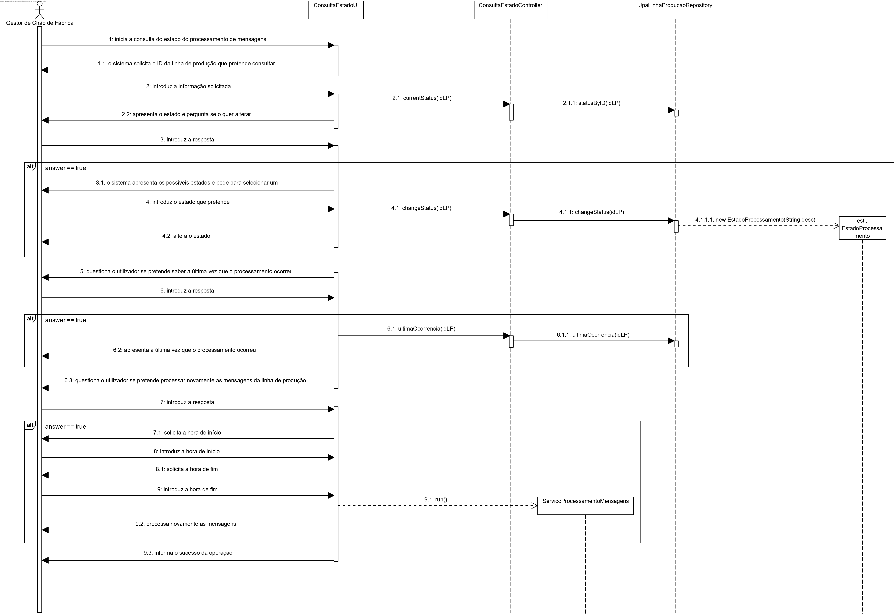
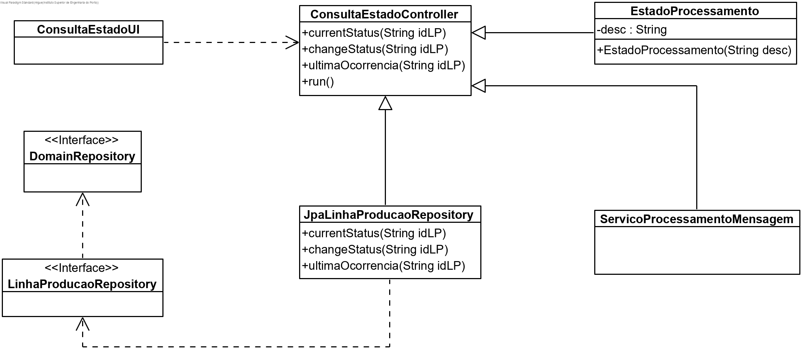

# User Story #3009
=======================================

# 1. Requisitos

**US3009**

Esta User Story consiste em consultar e alterar o estado do processamento de mensagens de cada linha de produção, bem como conhecer a última vez que o mesmo se realizou, enquanto Gestor de Chão de Fábrica (GCF).

# 2. Análise

Para esta funcionalidade será necessária uma autenticação prévia como Gestor de Chão de Fábrica (GCF), já que este deve ter acesso à consulta e alteração de informação do processamento de mensagens de cada linha de produção.

A alteração de estado, feita por linha de produção, passa por ativar ou desativar o processamento de mensagens ou então por solicitar um novo processamento de mensagens, dado um intervalo de tempo.

# 3. Design

## 3.1. Realização da Funcionalidade

1. O Gestor de Chão de Fábrica (autenticado em sistema) pretende consultar o estado do processamento de mensagens de uma linha de produção.
2. O sistema solicita o ID da linha de produção que pretende consultar.
3. O Gestor de Chão de Fábrica introduz a informação solicitada.
4. O sistema apresenta o estado da linha de produção e pergunta ao utilizador se o pretende alterar.
5. O Gestor de Chão de Fábrica introduz a resposta.  
5.1. Caso o Gestor de Chão de Fábrica queira alterar o estado, o sistema solicita o novo estado.  
5.2. O Gestor de Chão de Fábrica introduz o novo estado.  
6. O sistema solicita ao utilizador se pretende saber a última vez que o processamento ocorreu.  
6.1. Caso o Gestor de Chão de Fábrica queira saber a última vez que o processamento ocorreu, informa o sistema a sua intenção.  
6.2. O sistema apresenta a última vez que o processamento ocorreu.  
7. O sistema questiona o utilizador se pretende processar novamente as mensagens.  
7.1. Caso o Gestor de Chão de Fábrica queira reprocessar as mensagens, informa o sistema da sua intenção.  
7.2. O sistema reprocessa as mensagens.  
8. O sistema informa o sucesso da operação.



## 3.2. Diagrama de Classes



## 3.3. Padrões Aplicados

Para esta funcionalidade aplicamos o padrão _Repository_ de forma a termos acesso ao estado do processamento das mensagens e à hora da sua realização.

## 3.4. Testes

-

# 4. Implementação

-

# 5. Integração/Demonstração

Esta _User Story_ está integrada com as US 5001 e 5002, uma vez que ambas realizam o processamento de mensagens e podem fornecer as informações para demonstração desta funcionalidade.

# 6. Observações

-

